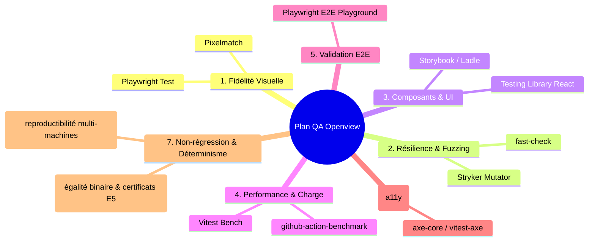

# Stratégie & Plan d'Outillage Qualité (QA) — Openview

> **Document QA & Ingénierie logicielle.** Définit la stratégie de test, les axes d'amélioration
> de la qualité et l'outillage préconisé pour garantir les engagements du projet Openview.
>
> Liens associés : [Roadmap globale](../roadmap/README.md) · [Core](../roadmap/core.md) ·
> [Moteur](../roadmap/engine.md) · [Viewer](../roadmap/viewer.md) ·
> [Service de rendu](../roadmap/service-de-rendu.md) · [Designer](../roadmap/designer.md) ·
> [AGENTS.md](../../AGENTS.md).

---

## 1. Contexte & Enjeux Qualité

Openview est un **moteur d'édition et de rendu de documents embarquable**. Ses engagements
clés imposent un niveau d'exigence très élevé :
1. **Déterminisme absolu (Lot E6 / ADR 0019)** : Aucun accès à l'environnement (horloge, fuseau, locale) ; deux exécutions sous un profil identique produisent un document strictement identique.
2. **Non-régression structurelle et binaire (Lot E7 / ADR 0020)** : Maintien d'un corpus de référence figé, vérifié par égalité binaire du PDF canonique, extraction par rang et conformité au certificat de pagination E5.
3. **Parité visuelle garantie (Décision 7 / Jalon J4 / Viewer V3)** : L'aperçu dans le Viewer React (qui consomme l'HTML autonome et le manifeste E5) et le document PDF final produit par le moteur doivent être visuellement identiques au pixel près.
4. **Robustesse face aux entrées hostiles (Lot E8)** : Résistance aux expressions récursives, boucles, attaques SSRF et gros volumes de données (factures de 60+ pages, 60 000+ lignes).
5. **Accessibilité & ergonomie pour non-développeurs (Jalon J6 / Décision 14)** : Édition assistée sans risque de générer un modèle invalide.

---

## 2. État des Lieux de l'Existant

Le socle d'Openview dispose d'une base rigoureuse outillée et vérifiée en intégration continue :

| Domaine | Outil / Pratique en place | Statut |
| :--- | :--- | :--- |
| **Typage strict & architecture** | TypeScript 7 (mode strict, `exactOptionalPropertyTypes`, `NodeNext`, `useUnknownInCatchVariables`) | 🟢 Opérationnel |
| **Linting & Gardes d'architecture** | Biome 2.5.10 + plugins GritQL (`no-environment-read`, `no-double-cast`, `no-silent-catch`) | 🟢 Opérationnel |
| **Validation des données** | Zod-first (`@openview/core`), AST versionné avec migrations `migrate(from, to)` | 🟢 Opérationnel |
| **Tests unitaires & Couverture** | Vitest 4.x avec seuil bloquant à **≥ 90 %** (lignes, branches, fonctions, instructions) | 🟢 ≥ 90 % sur `core`, `engine`, `adapter-puppeteer` (bloquant en CI), 0 % sur `designer`/`viewer` (coquilles prêtes pour V1/D1) |
| **Reproductibilité & Déterminisme** | Double runner Ubuntu 24.04 en CI comparant profil d'hôte (13 champs) et empreintes de 20 rendus ([ADR 0019](../adr/0019-le-meme-document-a-chaque-fois.md)) | 🟢 Opérationnel |
| **Corpus Golden Master PDF** | Job CI `golden-corpus` évaluant 6 scénarios / 21 pages (égalité binaire + mono-page par rang + certificat de pagination E5 + empreinte HTML) ([ADR 0020](../adr/0020-le-lot-de-documents-figes-de-non-regression.md)) | 🟡 Harnais et CI opérationnels, en attente d'acceptation du premier corpus Ubuntu |
| **Sécurité & Supply Chain** | Gitleaks (secrets), CodeQL, `pnpm audit --prod` bloquant en CI | 🟢 Opérationnel |
| **Analyse continue** | SonarCloud avec Quality Gate bloquante | 🟢 Opérationnel |

---

## 3. Les 7 Axes d'Amélioration & Outils Préconisés



---

### Axe 1 : Non-régression visuelle & Parité Pixel-Perfect (Viewer vs PDF)
* **Besoin produit** : Garantir que l'aperçu affiché dans `@openview/viewer` est strictement conforme au rendu PDF issu du moteur (Décision 7, Jalons J3/J4).
* **Risque** : Régression silencieuse lors des sauts de page, décalage des reports comptables ou rendu différent des polices/marges.

| Outil recommandé | Rôle dans Openview | Implémentation |
| :--- | :--- | :--- |
| **[Playwright](https://playwright.dev/)** | Capture automatisée de screenshots haute fidélité du DOM du Viewer en environnement headless. | `packages/viewer/__tests__/visual/` |
| **[Pixelmatch](https://github.com/mapbox/pixelmatch)** | Rasterisation des pages du PDF généré par `@openview/adapter-puppeteer` et comparaison pixel à pixel avec les captures du Viewer (diff d'images, seuil configurable). | `tools/visual-parity/` ou `packages/viewer/__tests__/` |

> ℹ️ **Frontière architecturale :** Conformément à AGENTS.md §2, `@openview/engine` n'importe pas Chromium et n'effectue aucun rendu direct. Le Viewer consomme l'HTML autonome et le manifeste de pagination certifié livrés par E5 ([ADR 0018](../adr/0018-le-moteur-sait-dire-ou-il-coupe.md)), sans recalculer de mise en page.

---

### Axe 2 : Tests basés sur les propriétés (Property-Based Testing) & Fuzzing
* **Besoin produit** : Valider la résilience du moteur d'expressions, des schémas AST Zod et des calculs de dates civiles face à des entrées imprévues ou malveillantes (Lot E8, [ADR 0003](../adr/0003-formules-agregations-et-dates-civiles.md)).
* **Risque** : Dépassement de pile récursif, plantage non typé, corruption silencieuse de template lors d'une migration.

| Outil recommandé | Rôle dans Openview | Implémentation |
| :--- | :--- | :--- |
| **[fast-check](https://fast-check.dev/)** | Génération automatique d'arbres AST et d'expressions aléatoires pour vérifier les invariants (idempotence de `migrate()`, bornes de calcul, non-crash). | `packages/core/src/**/__tests__/*.prop.test.ts` |
| **[Stryker Mutator](https://stryker-mutator.io/)** (`@stryker-mutator/vitest-runner`) | Mutation Testing : injecte des mutations de code pour évaluer la pertinence réelle des tests et traquer les tests tautologiques. | Exécution périodique / CI (Jalon J7) |

---

### Axe 3 : Tests de composants & Interactions UI (`@openview/designer` & `@openview/viewer`)
* **Besoin produit** : Couvrir les interactions riches de l'éditeur (grille de placement, barre de formule assistée, historique Command Undo/Redo immuable, gestion des calques) et l'encastrement sécurisé du Viewer.
* **Risque** : Régressions d'état React 19, rupture du flux d'annulation/rétablissement, bugs clavier/souris, injections XSS.

| Outil recommandé | Rôle dans Openview | Implémentation |
| :--- | :--- | :--- |
| **[@testing-library/react](https://testing-library.com/docs/react-testing-library/intro/)** + **`@testing-library/user-event`** | Tests d'intégration simulant les interactions utilisateur réelles (sélection, déplacement, écriture de formule) avec `happy-dom`. | `packages/designer/src/**/__tests__/*.test.tsx` et `packages/viewer/src/**/__tests__/*.test.tsx` |
| **[Storybook](https://storybook.js.org/)** ou **[Ladle](https://ladle.dev/)** | Catalogue isolé pour la recette visuelle et le test unitaire des blocs de modèles (Text, Container, Loop, Image, Grid). | `packages/designer/.storybook/` |

---

### Axe 4 : Benchmarking continu & Plafonds de Performance
* **Besoin produit** : Garantir le traitement fluide de gros volumes (60+ pages, 60 000 lignes) avec une empreinte mémoire et un temps de calcul bornés (Lots E6 & E8).
* **Risque** : Dégradation silencieuse de la complexité algorithmique lors de l'évaluation ou de la fusion DOM.

| Outil recommandé | Rôle dans Openview | Implémentation |
| :--- | :--- | :--- |
| **Vitest Bench (`bench()`)** / **[Tinybench](https://github.com/tinylibs/tinybench)** | Mesure fine du coût d'évaluation des expressions, du parsing Zod et des passes de transformation AST. | `packages/core/src/**/__bench__/*.bench.ts` |
| **[github-action-benchmark](https://github.com/benchmark-action/github-action-benchmark)** | Suivi automatique des métriques de temps et de mémoire par commit / PR avec alerte en cas de dérive (> +10 %). | `.github/workflows/bench.yml` |

---

### Axe 5 : Validation End-to-End (E2E) sur le Playground
* **Besoin produit** : Valider les flux complets d'intégration dans `apps/playground` (choisir un modèle -> injecter des données -> voir le rendu -> exporter le PDF).
* **Risque** : Rupture d'interopérabilité entre les 4 paquets (`core`, `engine`, `designer`, `viewer`).

| Outil recommandé | Rôle dans Openview | Implémentation |
| :--- | :--- | :--- |
| **Playwright E2E** | Scénarios de tests de bout en bout multi-navigateurs (Chromium, Firefox, WebKit). | `apps/playground/e2e/` |

---

### Axe 6 : Accessibilité (a11y) & Ergonomie Métier
* **Besoin produit** : Assurer que l'éditeur et le visualiseur sont pleinement accessibles au clavier et respectent les standards d'accessibilité (Jalon J6 / Décision 14).
* **Risque** : Blocage d'utilisateurs non-techniques lors de la navigation dans la grille ou la barre de formules.

| Outil recommandé | Rôle dans Openview | Implémentation |
| :--- | :--- | :--- |
| **[axe-core](https://github.com/dequelabs/axe-core)** (`vitest-axe` + `@axe-core/playwright`) | Détection automatique des défauts ARIA, contrastes insuffisants et ruptures de focus clavier. | Intégré dans les tests de composants et E2E |

---

### Axe 7 : Golden Master, Assertions Structurelles & Reproductibilité
* **Besoin produit** : Lots E6 ([ADR 0019](../adr/0019-le-meme-document-a-chaque-fois.md)) et E7 ([ADR 0020](../adr/0020-le-lot-de-documents-figes-de-non-regression.md)) : garantir le déterminisme inter-machines et maintenir un ensemble de factures de référence (une page, multi-pages avec report, bilingue fr/en, calques, témoin historique v1) pour figer les sorties attendues.
* **Risque** : Altération silencieuse des métadonnées, de la pagination ou de la mise en page d'une facture de référence ; dérive d'encodage selon l'hôte.

| Outil recommandé | Rôle dans Openview | Implémentation |
| :--- | :--- | :--- |
| **[pdf-lib](https://pdf-lib.js.org/)** + **Harnais E7** | Extraction déterministe d'un PDF mono-page par rang pour localiser la page en échec. Comparaison par **égalité binaire** du document canonique, doublée du certificat de pagination E5 et de l'empreinte de l'HTML autonome. | `tools/golden/` et `tests/golden/e7/references/` |
| **Profil E6** | Comparateur d'hôte (13 champs de profil) et contrôle de concordance des empreintes de rendu. | `tools/reproducibility/` et `.github/workflows/ci.yml` |

> ℹ️ **Rappel des décisions d'exécution (ADR 0020) :**
> - **`pdf-parse` a été écarté :** un oracle textuel perd positions, fontes, filets et images. L'égalité binaire du PDF canonique doublée des certificats de découpe E5 dit strictement plus, sans dépendance superflue.
> - **Localisation hors des paquets publiés :** les outils vivent dans `tools/golden/` et `tools/reproducibility/`, les références dans `tests/golden/e7/references/`, et les tests dans `packages/adapter-puppeteer/src/__tests__/`. Aucun de ces fichiers n'entre dans un tarball publié.

---

## 4. Feuille de Route de Déploiement QA (par Jalon)

```
Étape 1 : Socle, Moteur & Déterminisme (Jalons J1, J2, J3) — Quasi achevé
  ├── 1. Validation Zod v4, diagnostics et migrations AST versionnées (J1) [🟢 Livré]
  ├── 2. Pagination et reports comptables testés à ≥ 90% (J2, J3) [🟢 Livré]
  ├── 3. Déterminisme et reproductibilité inter-machines (E6) [🟢 Livré]
  ├── 4. Corpus Golden Master PDF 21 pages (E7) [🟡 Harnais livré, amorçage en cours]
  └── 5. Relecture humaine de la facture comptable par un gestionnaire [⬜ Reste dû pour clore J3]

Étape 2 : Aperçu & Parité Visuelle (Jalon J4 - Viewer)
  ├── 6. Tests de composants Viewer (React Testing Library) sur l'HTML autonome E5 (V1, V2)
  └── 7. Playwright + Pixelmatch pour la parité pixel-perfect Viewer vs PDF (V3)

Étape 3 : Service & Robustesse aux Entrées Hostiles (Jalon J5 - Service)
  ├── 8. Tests de charge et résistance aux documents hostiles (boucles, SSRF, DoS, mémoire) (E8)
  └── 9. Vitest Benchmarks continus pour surveiller les performances d'évaluation et de rendu

Étape 4 : Édition Métier & Livraison Publique (Jalons J6, J7 - Designer & Transverse)
  ├── 10. Tests de composants Designer (React Testing Library + user-event) pour la grille, la barre de formule et l'historique Undo/Redo
  ├── 11. Tests d'accessibilité (axe-core / vitest-axe) sur l'interface du Designer (J6 / D3)
  ├── 12. Tests E2E Playwright sur le playground (J7)
  └── 13. Stryker Mutator pour éliminer les tests tautologiques avant publication (J7)
```

---

## 5. Indicateurs Qualité (KPIs)

| Indicateur | Cible finale | État actuel |
| :--- | :--- | :--- |
| **Couverture de code (lignes/branches/fonctions)** | **≥ 90 %** bloquant sur chaque paquet | 🟢 100 % sur `core`, > 95 % sur `engine`, > 90 % sur `adapter-puppeteer` (bloquant en CI) |
| **Reproductibilité inter-machines** | **100 %** d'identité sous même profil (E6) | 🟢 1 seule empreinte sur 20 rendus (2 runners Ubuntu 24.04 indépendants) |
| **Non-régression Golden Master** | **0 divergence** sur les 6 scénarios / 21 pages (E7) | 🟡 Harnais et CI opérationnels, en attente d'acceptation du premier corpus Ubuntu |
| **Taux de divergence visuelle (Viewer vs PDF)** | **0 %** sur le corpus de factures de référence | ⬜ Cible J4 (Lot V3) |
| **Score d'accessibilité (axe-core)** | **0 violation critique ou majeure** | ⬜ Cible J6 (Designer D3) |
| **Score de mutation (Stryker)** | **≥ 80 %** sur le module d'évaluation et validation Zod | ⬜ Cible J7 |
| **Robustesse aux entrées hostiles** | Refus typé, nettoyage attesté et témoin vert après chaque attaque (E8) | 🟡 Bornes, courtier de ressources, worker tuable et pool livrés et testés ; corpus hostile outillé et job CI dédié non livrés (ADR 0021) |
| **Budget de performance** | Facture 60 pages / 60 000 lignes en **< 2,0 s** | ⬜ **Non mesuré.** Cible J5 (Lot E8) — le protocole de mesure existe dans le plan E8, aucun chiffre n'a encore été relevé sur l'hôte officiel |
