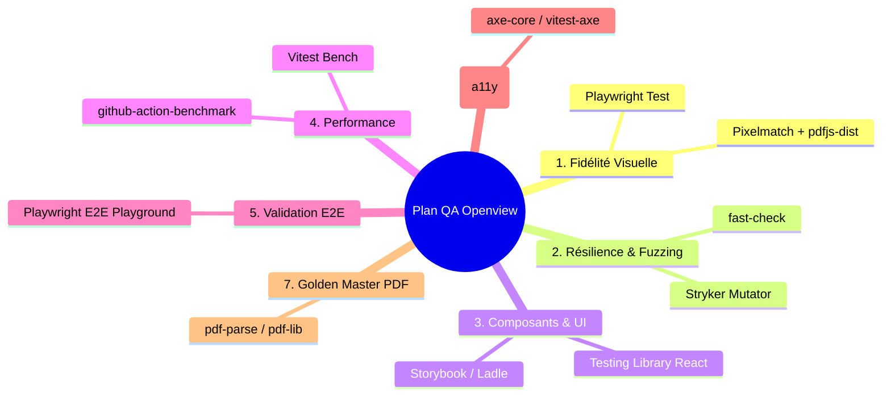

# Stratégie & Plan d'Outillage Qualité (QA) — Openview

> **Document QA & Ingénierie logicielle.** Définit la stratégie de test, les axes d'amélioration
> de la qualité et l'outillage préconisé pour garantir les engagements du projet Openview.
>
> Liens associés : [Roadmap globale](../roadmap/README.md) · [Moteur](../roadmap/engine.md) ·
> [Viewer](../roadmap/viewer.md) · [Designer](../roadmap/designer.md) · [AGENTS.md](../../AGENTS.md).

---

## 1. Contexte & Enjeux Qualité

Openview est un **moteur d'édition et de rendu de documents embarquable**. Ses engagements
clés imposent un niveau d'exigence très élevé :
1. **Déterminisme absolu (Lot E6)** : Aucun accès à l'environnement (horloge, fuseau, locale) ; deux exécutions doivent produire un document strictement identique.
2. **Parité visuelle garantie (Décision 7 / Jalon J4)** : L'aperçu dans le Viewer React et le document PDF final produit par le moteur doivent être visuellement identiques au pixel près.
3. **Robustesse face aux entrées hostiles (Lot E8)** : Résistance aux expressions récursives, boucles et gros volumes de données (factures de 60+ pages, 60 000+ lignes).
4. **Accessibilité & ergonomie pour non-développeurs (Jalon J6 / Décision 14)** : Édition assistée sans risque de générer un modèle invalide.

---

## 2. État des Lieux de l'Existant

Le socle initial d'Openview dispose déjà d'une base rigoureuse :

| Domaine | Outil / Pratique en place | Statut |
| :--- | :--- | :--- |
| **Typage strict & architecture** | TypeScript 7 (mode strict, `exactOptionalPropertyTypes`, `NodeNext`, `useUnknownInCatchVariables`) | 🟢 Opérationnel |
| **Linting & Gardes d'architecture** | Biome 2.5.8 + plugins GritQL (`no-environment-read`, `no-double-cast`, `no-silent-catch`) | 🟢 Opérationnel |
| **Validation des données** | Zod v4-first (`@openview/core`), AST versionné avec migrations `migrate(from, to)` | 🟢 Opérationnel |
| **Tests unitaires & Couverture** | Vitest 4.x avec seuil bloquant à **≥ 90 %** (lignes, branches, fonctions, instructions) | 🟡 100 % sur `core`, 0 % sur `designer`/`viewer` |
| **Sécurité & Supply Chain** | Gitleaks (secrets), CodeQL, `pnpm audit --prod` bloquant en CI | 🟢 Opérationnel |
| **Analyse continue** | SonarCloud avec Quality Gate bloquante | 🟢 Opérationnel |

---

## 3. Les 7 Axes d'Amélioration & Outils Préconisés



---

### Axe 1 : Non-régression visuelle & Parité Pixel-Perfect (Viewer vs PDF)
* **Besoin produit** : Garantir que l'aperçu affiché dans `@openview/viewer` est strictement conforme au rendu PDF issu de `@openview/engine` (Décision 7, Jalons J3/J4).
* **Risque** : Régression silencieuse lors des sauts de page, décalage des reports comptables ou rendu différent des polices/marges.

| Outil recommandé | Rôle dans Openview | Implémentation |
| :--- | :--- | :--- |
| **[Playwright](https://playwright.dev/)** | Capture automatisée de screenshots haute fidélité du DOM du Viewer en environnement headless. | `packages/viewer/__tests__/visual/` |
| **[Pixelmatch](https://github.com/mapbox/pixelmatch)** + **[pdfjs-dist](https://github.com/mozilla/pdf.js)** | Rasterisation des pages du PDF généré par le moteur et comparaison pixel à pixel avec les captures du Viewer (diff d'images, seuil configurable). | `packages/engine/__tests__/visual-parity/` |

---

### Axe 2 : Tests basés sur les propriétés (Property-Based Testing) & Fuzzing
* **Besoin produit** : Valider la résilience du moteur d'expressions, des schémas AST Zod et des calculs de dates civiles face à des entrées imprévues ou malveillantes (Lot E8, [ADR 0003](../adr/0003-formules-agregations-et-dates-civiles.md)).
* **Risque** : Dépassement de pile récursif, plantage non typé, corruption silencieuse de template lors d'une migration.

| Outil recommandé | Rôle dans Openview | Implémentation |
| :--- | :--- | :--- |
| **[fast-check](https://fast-check.dev/)** | Génération automatique d'arbres AST et d'expressions aléatoires pour vérifier les invariants (idempotence de `migrate()`, bornes de calcul, non-crash). | `packages/core/src/**/__tests__/*.prop.test.ts` |
| **[Stryker Mutator](https://stryker-mutator.io/)** (`@stryker-mutator/vitest-runner`) | Mutation Testing : injecte des mutations de code pour évaluer la pertinence réelle des tests et traquer les tests tautologiques. | Exécution périodique / CI |

---

### Axe 3 : Tests de composants & Interactions UI (`@openview/designer` & `@openview/viewer`)
* **Besoin produit** : Couvrir les interactions riches de l'éditeur (grille de placement, barre de formule assistée, historique Command Undo/Redo immuable, gestion des calques).
* **Risque** : Régressions d'état React 19, rupture du flux d'annulation/rétablissement, bugs clavier/souris.

| Outil recommandé | Rôle dans Openview | Implémentation |
| :--- | :--- | :--- |
| **[@testing-library/react](https://testing-library.com/docs/react-testing-library/intro/)** + **`@testing-library/user-event`** | Tests d'intégration simulant les interactions utilisateur réelles (sélection, déplacement, écriture de formule) avec `happy-dom`. | `packages/designer/src/**/__tests__/*.test.tsx` |
| **[Storybook](https://storybook.js.org/)** ou **[Ladle](https://ladle.dev/)** | Catalogue isolé pour la recette visuelle et le test unitaire des blocs de modèles (Text, Container, Loop, Image). | `packages/designer/.storybook/` |

---

### Axe 4 : Benchmarking continu & Plafonds de Performance
* **Besoin produit** : Garantir le traitement fluide de gros volumes (60+ pages, 60 000 lignes) avec une empreinte mémoire et un temps de calcul bornés (Lots E6 & E8).
* **Risque** : Dégradation silencieuse de la complexité algorithmique lors de l'évaluation ou de la fusion DOM.

| Outil recommandé | Rôle dans Openview | Implémentation |
| :--- | :--- | :--- |
| **Vitest Bench (`bench()`)** / **[Tinybench](https://github.com/tinylibs/tinybench)** | Mesure fine du coût d'évaluation des expressions, du parsing Zod et des passes de transformation AST. | `packages/core/src/**/__bench__/*.bench.ts` |
| **[github-action-benchmark](https://github.com/benchmark-action/github-action-benchmark)** | Suivi automatique des métriques de temps et de mémoire par commit / PR avec alerte en cas de dérive (> +10 %). | `.github/workflows/bench.yml` |

---

### Axe 5 : Validation End-to-End (E2E) sur le Playground
* **Besoin produit** : Valider les flux complets d'intégration dans `apps/playground` (choisir un modèle -> injecter des données -> voir le rendu -> exporter le PDF).
* **Risque** : Rupture d'interopérabilité entre les 4 paquets (`core`, `engine`, `designer`, `viewer`).

| Outil recommandé | Rôle dans Openview | Implémentation |
| :--- | :--- | :--- |
| **Playwright E2E** | Scénarios de tests de bout en bout multi-navigateurs (Chromium, Firefox, WebKit). | `apps/playground/e2e/` |

---

### Axe 6 : Accessibilité (a11y) & Ergonomie Métier
* **Besoin produit** : Assurer que l'éditeur et le visualiseur sont pleinement accessibles au clavier et respectent les standards d'accessibilité (Jalon J6 / Décision 14).
* **Risque** : Blocage d'utilisateurs non-techniques lors de la navigation dans la grille ou la barre de formules.

| Outil recommandé | Rôle dans Openview | Implémentation |
| :--- | :--- | :--- |
| **[axe-core](https://github.com/dequelabs/axe-core)** (`vitest-axe` + `@axe-core/playwright`) | Détection automatique des défauts ARIA, contrastes insuffisants et ruptures de focus clavier. | Intégré dans les tests de composants et E2E |

---

### Axe 7 : Golden Master & Assertions Structurelles PDF
* **Besoin produit** : Lot E7 (« Lot de documents figés de non-régression ») : maintenir un ensemble de factures de référence (une page, multi-pages avec report, bilingue, calques, témoin historique v1) pour figer les sorties attendues.
* **Risque** : Altération silencieuse des métadonnées, de la pagination ou de la mise en page d'une facture de référence.

| Outil recommandé | Rôle dans Openview | Implémentation |
| :--- | :--- | :--- |
| **[pdf-lib](https://pdf-lib.js.org/)** (déjà dépendance de l'adaptateur) | Extraction déterministe d'un PDF mono-page par rang, pour nommer la ou les pages qui ont bougé. La comparaison elle-même est une **égalité binaire** du document canonique, doublée du certificat de pagination E5 et de l'empreinte de l'HTML autonome. | `tools/golden/` et `tests/golden/e7/references/` |

> **Rectifié après exécution (2026-08-29,
> [ADR 0020](../adr/0020-le-lot-de-documents-figes-de-non-regression.md)).** Deux points de la
> recommandation initiale ne survivent pas au lot livré :
>
> - **`pdf-parse` n'est pas retenu, et aucune dépendance n'a été ajoutée.** Un oracle fondé sur le
>   texte extrait perd les positions, les fontes, les filets et les images — c'est-à-dire presque
>   tout ce qu'une régression de rendu déplace. L'égalité binaire du PDF canonique, qualifiée par le
>   profil de reproductibilité E6, dit strictement plus, et `pdf-lib` suffit à la localiser page par
>   page.
> - **Le corpus ne vit pas dans `packages/engine/`.** Le rendu réel passe par Puppeteer, qui doit
>   rester hors du paquet moteur (AGENTS.md §2) : l'outillage est dans `tools/golden/`, les
>   références dans `tests/golden/e7/references/`, les tests du harnais dans
>   `packages/adapter-puppeteer/src/__tests__/`. Aucun de ces fichiers n'entre dans un tarball
>   publié.
>
> La ligne 3 de la feuille de route ci-dessous (Playwright + Pixelmatch, parité aperçu ↔ PDF) est
> **inchangée** : E7 compare des PDF entre eux et ne prononce rien sur l'aperçu React. C'est le lot
> V3 du [viewer](../roadmap/viewer.md#v3-la-garantie-est-vérifiée-automatiquement).

---

## 4. Feuille de Route de Déploiement QA (par Jalon)

```
Phase 1 : Socle Moteur & Contrats (Jalons J1 - J2)
  ├── 1. fast-check pour l'AST, les limites d'expressions et les dates civiles
  └── 2. React Testing Library dans @openview/designer et @openview/viewer

Phase 2 : Rendu Comptable & Fidélité Visuelle (Jalons J3 - J4)
  ├── 3. Playwright + Pixelmatch pour la parité pixel-perfect Viewer vs PDF
  ├── 4. Corpus Golden Master PDF (pdf-lib, égalité binaire) sur les factures de référence
  └── 5. Vitest Benchmarks pour surveiller les performances d'évaluation et de rendu

Phase 3 : Édition Métier & Livraison Publique (Jalons J5 - J7)
  ├── 6. Tests E2E Playwright sur apps/playground
  ├── 7. axe-core (vitest-axe) pour l'accessibilité du Designer
  └── 8. Stryker Mutator pour valider la robustesse globale avant publication
```

---

## 5. Indicateurs Qualité (KPIs) Cibles

- **Couverture de code** : Seuil bloquant maintenu à **≥ 90 %** sur chaque paquet.
- **Taux de divergence visuelle (Viewer vs PDF)** : **0 %** sur le corpus de factures de référence.
- **Score d'accessibilité (axe-core)** : **0 violation critique ou majeure**.
- **Score de mutation (Stryker)** : **≥ 80 %** sur le module d'évaluation et de validation Zod (`@openview/core`).
- **Budget de performance** : Génération d'une facture de 60 pages / 60 000 lignes en **< 2,0 secondes** sans fuite mémoire.
